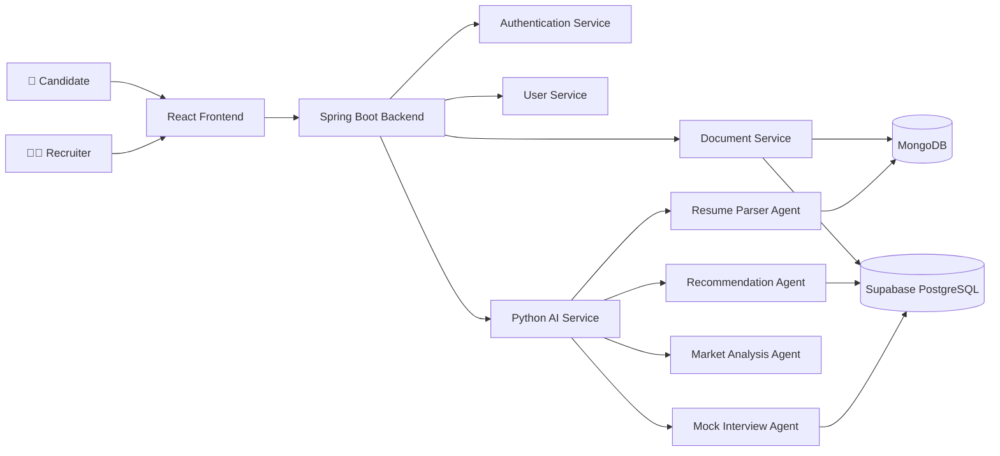
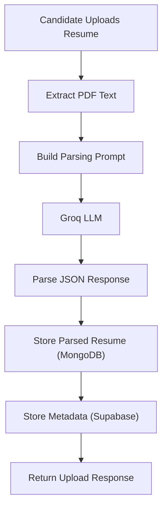
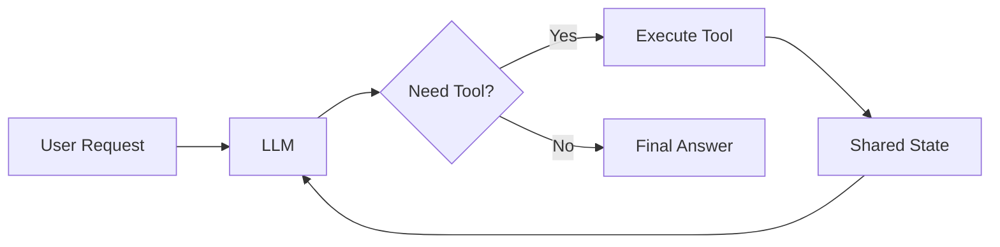
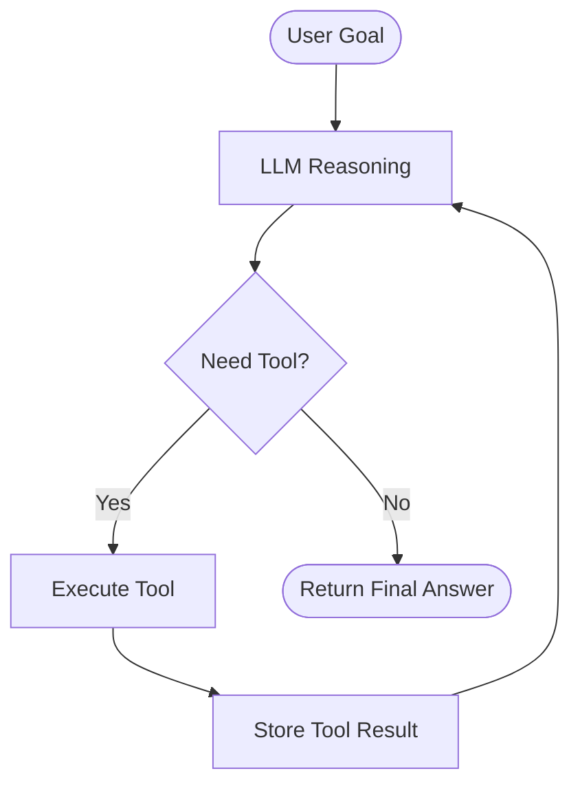
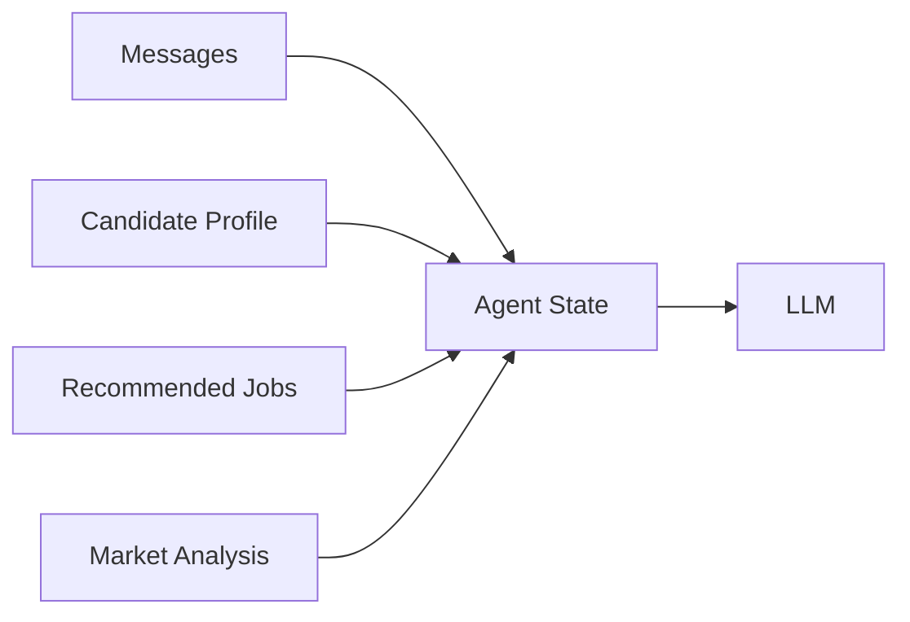
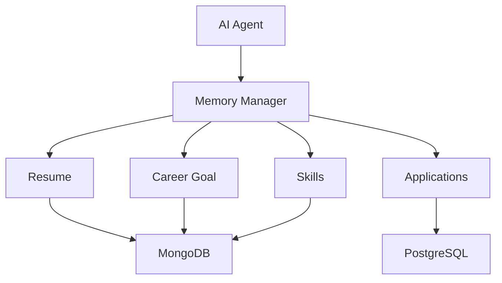
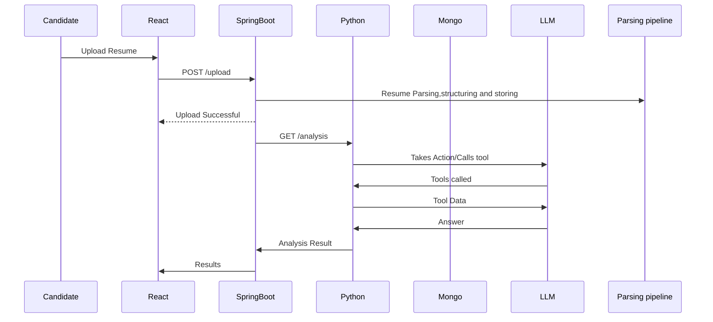

This is the Phase II of the Hr-ai-portal dedicatedly created for candidates
This portal is created to help students get jobs, prepare themselves for upcoming interviews, identify where they possibly lag, apply for jobs recommended by the recommendation engine based on the resume and and tell the candidate what the market requirements are for their experience level.

The portal follows Micro Service architecture with main backend written in Java SpringBoot and the AI service layer.This repository consists of the AI layer of the candidate portal written in python using FlaskApi library

The Idea:
user signup-> user login->Auth verified->Dashboard->upload resume->gets ATS of resume->AI layer activated-> recommended matching jobs, listed market requirements for provided experience, provides suggestions for resume improvement(like adding a valuable project, skill etc)-> tracks job using tools-> takes next step as per data -> takes mock interview (if needed) -> state updates after every tool call -> loop from job tracking.

Features:
ATS score of resume
Comparison with market demand
Mock interview to analyze knowledge depth and content delivery
Job recommendations

Future features:
Cold Emailing/Messages on linkedIn
Application status tracking and alerts

Tools provided:
Recommendation tool (compares a candidate against a JD/market requirements/job rankings)
Job search tool (fetches recommended jobs from SQL)
Market requirements tool (fetches market requirements)
Skill extraction tool

Sub Agent:
Mock interview agent (grills candidate for their target role and resume)

Data regarding jobs, market requirements, chats of mock interview and responses of tools will be stored and fetched from SQL tables whereas resume parsed data, will be stored in MongoDB

SQL Schema:
interviews table
interview_id,user_id,doc_id,ststus,created_at,completed_at

intewrviewchats table
chat_id,interview_id,role(candidate/bot),chat,stored_at

interviewverdict table
verdict_id,interview_id,user_id,strengths,weakness,vedict,verdict reason,recommendations,score,overall performance

Marketrequirements table
req_id,role,experience(years),required_skills

jobs table
job_id,title,jd,skills required,postedAt,link to apply,last date,source

outputs of tools
recommendation tool
JSON format {{
    "match_percentage": <integer 0-100>,
    "strength": "<STRONG|MODERATE|WEAK>",
    "matching_skills": ["skill1", "skill2"],
    "missing_skills": ["skill3", "skill4"],
    "recommendation": "<one clear sentence summarising fit>"
}}

market requirement tool
list [matching skills]

jobs tool
job_id, title, skills_required, source, apply_link, last_date

mock interview tool
JSON(strength,weakness,verdict)

The agent memory
agent has 2 type of memory:long-term and short-term
short-term memory:what is passed to LLM at every LLM call.
this includes initial prompts, actions taken by LLM (tool calling/response generation), results of tools, verdict of mock interview subagent. this memory is short lived and stays in python memory so it disappears and we encounter the problem of consistency. How will the LLM work if user abandons app for certain days or the improvement process is long and short lived memory cant be stored in python memory forever. to handle this, we implement longterm memory

long-term memory: which stays in database to maintain consistency throughout the process
since improvement in skills is a longterm process, it is recommended to store the LLM context somewhere to maintain consistency. in long-term memory lives what all was in short term memory except everything isnt worth remembring like job listing is fresh everyday. so longterm memory consists of storing usergoal, verdict of interview, recommendation against comparison with market, interview chats and things which actually improves the user performance overtime.

Updated Readme starts here:
## 🏗️ System Architecture

## 📄 Candidate Resume Upload Pipeline

## 🤖 AI Agent Harness

## 🔄 ReAct Execution Loop

## 🧠 Agent State

## 💾 Long-Term Memory

## 🔗 Service Communication

