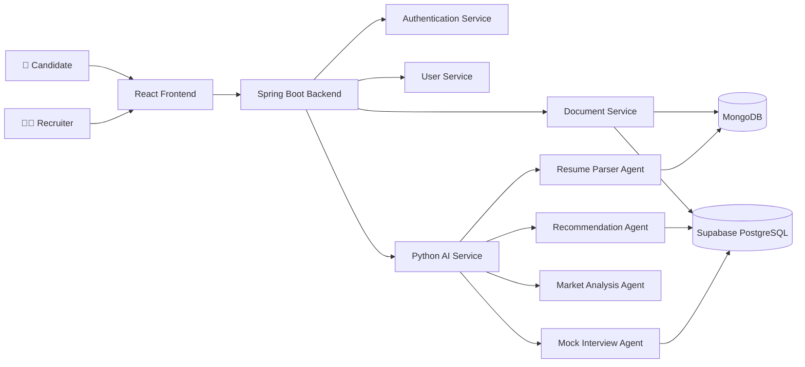
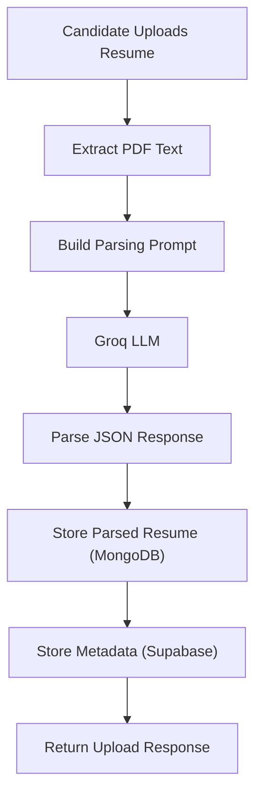
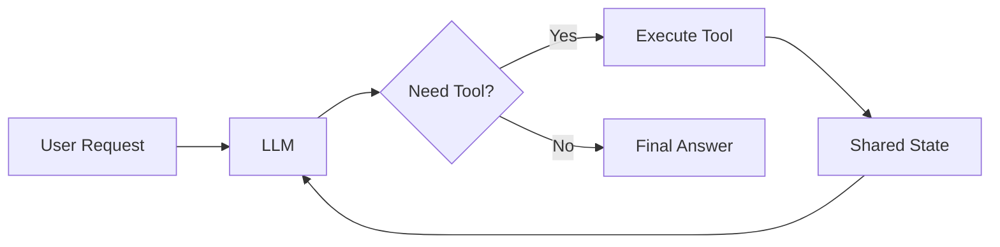
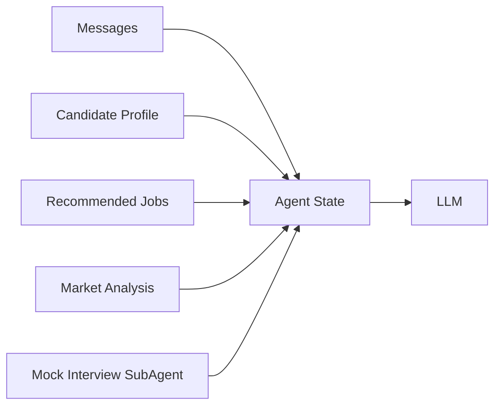
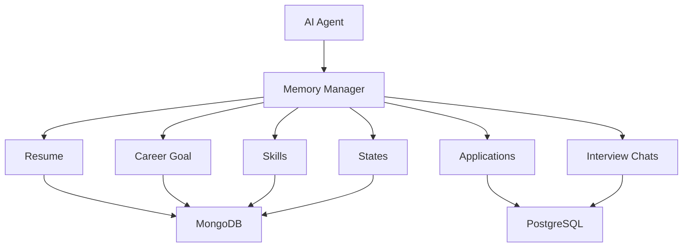
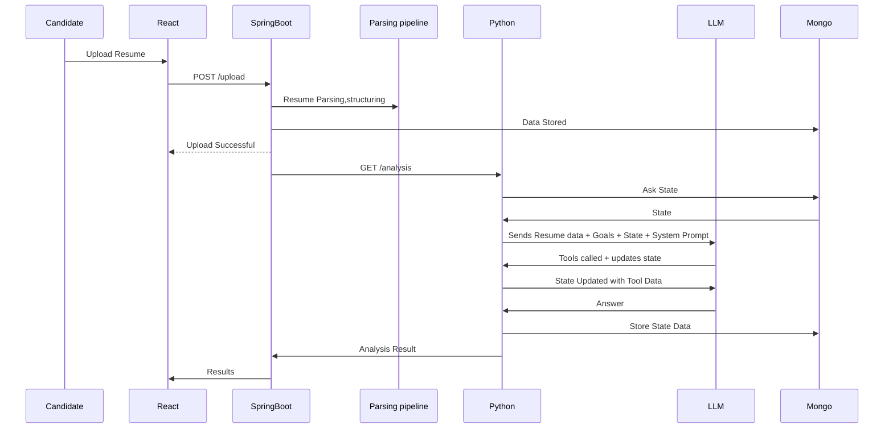

## 🏗️ System Architecture


## 📄 Candidate Resume Upload Pipeline


## 🤖 AI Agent Harness


## 🔄 ReAct Execution Loop


## 🧠 Agent State


## 💾 Long-Term Memory


## 🔗 Service Communication

```mermaid
sequenceDiagram

    participant Candidate

    participant React

    participant SpringBoot
    participant Parsing pipeline

    participant Python
    participant LLM
    participant Mongo
    

    Candidate->>React: Upload Resume

    React->>SpringBoot: POST /upload

    SpringBoot->>Parsing pipeline: Resume Parsing,structuring
    SpringBoot->>Mongo: Data Stored

    SpringBoot-->>React: Upload Successful

    SpringBoot->>Python: GET /analysis

    Python->> Mongo: Ask State
    Mongo->> Python: State
    Python->>LLM: Sends Resume data + Goals + State + System Prompt
    LLM->>Python: Tools called + updates state

    Python->>LLM: State Updated with Tool Data

    LLM->>Python: Answer
    Python->>Mongo : Store State Data

    Python->>SpringBoot: Analysis Result

    SpringBoot->>React: Results
## 🏗️ System Architecture

```mermaid
flowchart LR

    Candidate["👤 Candidate"]
    HR["👨‍💼 Recruiter"]

    Frontend["React Frontend"]

    Backend["Spring Boot Backend"]

    Auth["Authentication Service"]
    User["User Service"]
    Document["Document Service"]

    Python["Python AI Service"]

    Resume["Resume Parser Agent"]
    Recommend["Recommendation Agent"]
    Market["Market Analysis Agent"]
    Interview["Mock Interview Agent"]

    SQL[(Supabase PostgreSQL)]
    Mongo[(MongoDB)]

    Candidate --> Frontend
    HR --> Frontend

    Frontend --> Backend

    Backend --> Auth
    Backend --> User
    Backend --> Document

    Document --> Mongo
    Document --> SQL

    Backend --> Python

    Python --> Resume
    Python --> Recommend
    Python --> Market
    Python --> Interview

    Resume --> Mongo
    Recommend --> SQL
    Interview --> SQL
```
## 📄 Candidate Resume Upload Pipeline


## 🤖 AI Agent Harness


## 🔄 ReAct Execution Loop


## 🧠 Agent State


## 💾 Long-Term Memory


## 🔗 Service Communication

